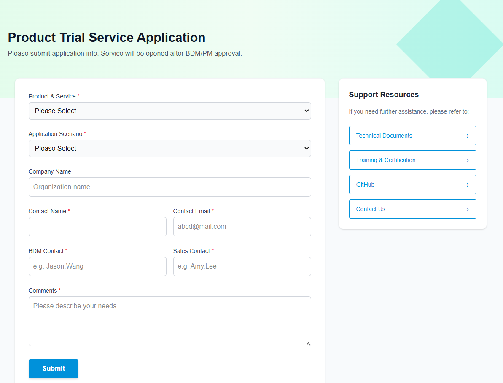

# Product Trial Service Application Portal

A web application built with **Next.js 14+** designed for the product trial requests. This system features a sleek UI for users to submit applications, which are then automatically synchronized to a **Supabase (PostgreSQL)** database. for administrative review.

## Key Features

* **Responsive UI/UX**: A interface mimicking enterprise-grade service portals.
* **Dynamic Form Validation**: Built-in validation for required fields such as Product Selection, Contact Info, and Application Scenarios.
* **Serverless Backend**: Utilizes Next.js API Routes to securely forward data to external APIs, keeping environment variables protected.
* **Supabase Integration**: Real-time data persistence using PostgreSQL for reliable lead management.

---

## Wed UI


---

## Project Structure
```bash
TrialForm
│
├── app/
│   ├── api/
│   │   └── submit/
│   │       └── route.ts      # POST API handler that forwards data to Google Sheets
│   └── page.tsx              # Main application page with form UI and state management
├── lib/
│   └── options.ts            # Centralized configuration for product lists and scenario options
├── image/                    # Image
│   └── TrialFormPortal.png   # Web UI
├── package.json              # Project dependencies and scripts
└── README.md                 # Document
```
---

## Technical Stack
* **Framework**: Next.js 14 (App Router)
* **Styling**: Tailwind CSS
* **Language**: TypeScript
* **Database**: Supabase (PostgreSQL)
* **SDK**: @supabase/supabase-js
---

## Getting Started

### 1. Pre-requisites (Supabase Setup)
Before running the application, you must have a Supabase account and project:
1. **Sign Up**  
   Go to Supabase.com and create a free account.

2. **Create Project**  
   Start a new project (e.g., `Trial-Portal`).

3. **Create Table**  
   Navigate to the **SQL Editor** in your Supabase dashboard and run:
    ```sql
    create table applications (
      id bigint generated by default as identity primary key,
      created_at timestamp with time zone default now(),
      product text,
      scenario text,
      company text,
      contact_name text,
      contact_email text,
      bdm text,
      sales text,
      comments text
    );
    ```
### 2. Installation
```bash
git clone <your-repository-url>
cd trial-form-web-db
npm install
```
### 3. Environment Setup
Create a `.env.local` file in the root directory and add your Supabase credentials (**Project Settings > API**):
```bash
NEXT_PUBLIC_SUPABASE_URL=[https://your-project-id.supabase.co](https://your-project-id.supabase.co)
NEXT_PUBLIC_SUPABASE_ANON_KEY=your-publishable-anon-key
```
### 3. Development Mode
If you are developing in an environment with strict network or SSL restrictions (common in Windows/Corporate networks), use the following command to prevent fetch failed errors:

#### Windows (PowerShell):
```bash
# PowerShell
$env:NODE_TLS_REJECT_UNAUTHORIZED = "0"; npm run dev
```
#### Mac / Linux:

```bash
# Bash
NODE_TLS_REJECT_UNAUTHORIZED=0 npm run dev
Open http://localhost:3000 to view the application.
```
---

## Database Schema

The following table describes how the front-end form fields map to the Supabase applications table:
| Frontend Field | Database Column | Data Type     | Description                                   |
|---------------|----------------|---------------|-----------------------------------------------|
| product       | product        | text          | Selected product (IoTSuite / iEMS)             |
| scenario      | scenario       | text          | Application scenario                           |
| company       | company        | text          | Organization name (Optional)                  |
| contactName  | contact_name   | text          | Applicant's full name                         |
| contactEmail | contact_email  | text          | Applicant's email address                    |
| bdm           | bdm            | text          | BDM Contact (Manual Input)                    |
| sales         | sales          | text          | Sales Contact (Manual Input)                  |
| comments      | comments       | text          | Additional notes or requirements              |
| (Auto-generated) | id          | int8          | Primary Key (Identity)                        |
| (Auto-generated) | created_at  | timestamptz   | Submission timestamp                          |


---


